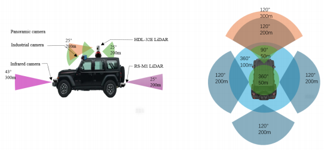
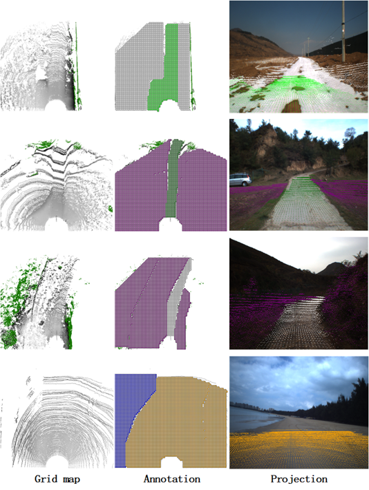

# TerraVerse: A Multimodal Sensor Dataset for Unstructured Scenes Spanning Multiple Regions in China

**This work was jointly completed by **Beijing Institute of Technology** and **Beijing University**.

## Overview

[](https://github.com/user-attachments/assets/cf26d446-ae29-4373-8b5e-173f74f38c35)


## Dataset Discription
  TerraVerse indicates 33.3 per cent of paved sences and 66.7 per cent off-road scenes. The dataset is divided into 26 different categories with the aim of analysing the impact of time of day, weather conditions, and terrain environments on performance, including scenarios such as night-time city, daytime desert, and evening beach.The primary terrain encompasses seven categories: desert, beach, gravel, paved, water, snow, and grass. In addition, the dataset encompasses fifteen types of targets including car, people, traffic sign, ship, etc. The size format of the recorded image files is 1024 x 768 pixels. Also TerraVerse contains synchronised vehicle underlay and point cloud data, at night we also use infrared camera for data acquisition work, these multimodal data will help to advance the development of driverless technology.

<div align=center>

</div>

## Recording Platform


[Jeep Wrangle](https://www.jeep.com/wrangler.html "The official website of Jeep Wrangle")

## Sensor Setup
-Three [RS-M1](https://www.robosense.ai/rslidar/RS-LiDAR-M1) solid-state LiDARs are utilised to collect point cloud information. 

-A Velodyne [HDL-32E](https://pdf.directindustry.com/pdf/velodynelidar/hdl-32e-datasheet/182407-676098.html) LiDAR was utilised to acquire point cloud data over a 360° range of the vehicle. 

-A Ladybug [LD5P-U3-51S5C-R/B](https://www.teledynevisionsolutions.com/zh-cn/products/ladybug5plus/?model=LD5P-U3-51S5C-B&vertical=machine%20vision&segment=iis) panoramic camera for capturing image information over a 360° range of the vehicle. 

-The [MER2-231-41GC-P](https://www.daheng-imaging.com/show-104-1900-1.html) industrial camera has been utilised to facilitate the direct acquisition of image information in the frontal perspective of the wheeled platform. 

-An [XW-GI7660](https://www.starneto.com/chanpin_view/498.html) fibre-optic combined navigation system collects information about the vehicle's location, direction and speed from the satellite positioning system, and its position and movement information from the inertial navigation system. 

The setup and detection range of each sensor:

<div align=center>

</div>

## Annotations
### Image
The semantic annotation of images is achieved by SAM.


### Point cloud
  The construction of the corresponding grid map was achieved by integrating the collected LiDAR point cloud data with GPS positioning and IMU combined navigation data. The ground semantics were annotated on the grid map.



## Data Sample
We offer some samples here for you to know TerraVerse better. The sample files we uploaded encompass raw images, LIDAR data, and some annotated examples. The image data is in "png" format, while the point cloud data from the laser radar is in "pcap" format. We have annotated both the objects and semantics. The structure of the sample files is illustrated in the figure below:

```
Sample
│
├─rawdata
│  ├─image
│  │      1602313407553149.png
│  │      1602313407619700.png
│  │      1602313407686391.png
│  │      ...
│  │      1602313407819785.png
│  │      1602313407886490.png
│  │      1602313407953181.png
│  │
│  └─lidar
│          Raw-001-HDL32.pcap
│
├─semantic annotation
│  ├─grid-map-annotation
│  │  ├─gridmap
│  │  │  ├─annotation
│  │  │  │      54208152.png
│  │  │  │      54208819.png
│  │  │  │      54209484.png
│  │  │  │      54210151.png
│  │  │  │      54210817.png
│  │  │  │      54211483.png
│  │  │  │      54212150.png
│  │  │  │      54212817.png
│  │  │  │      54213484.png
│  │  │  │      54214151.png
│  │  │  │
│  │  │  └─background
│  │  │          54208152_background.png
│  │  │          54208819_background.png
│  │  │          54209484_background.png
│  │  │          54210151_background.png
│  │  │          54210817_background.png
│  │  │          54211483_background.png
│  │  │          54212150_background.png
│  │  │          54212817_background.png
│  │  │          54213484_background.png
│  │  │          54214151_background.png
│  │  │
│  │  ├─projection
│  │  │  ├─ladybug camera
│  │  │  │      54208152_cam.png
│  │  │  │      54208152_cam_raw.png
│  │  │  │      54208819_cam.png
│  │  │  │      54208819_cam_raw.png
│  │  │  │      54209484_cam.png
│  │  │  │      54209484_cam_raw.png
│  │  │  │      54210151_cam.png
│  │  │  │      54210151_cam_raw.png
│  │  │  │      54210817_cam.png
│  │  │  │      54210817_cam_raw.png
│  │  │  │      54211483_cam.png
│  │  │  │      54211483_cam_raw.png
│  │  │  │      54212150_cam.png
│  │  │  │      54212150_cam_raw.png
│  │  │  │      54212817_cam.png
│  │  │  │      54212817_cam_raw.png
│  │  │  │      54213484_cam.png
│  │  │  │      54213484_cam_raw.png
│  │  │  │      54214151_cam.png
│  │  │  │      54214151_cam_raw.png
│  │  │  │
│  │  │  └─mono camera
│  │  │          54208152_pro.png
│  │  │          54208819_pro.png
│  │  │          54209484_pro.png
│  │  │          54210151_pro.png
│  │  │          54210817_pro.png
│  │  │          54211483_pro.png
│  │  │          54212150_pro.png
│  │  │          54212817_pro.png
│  │  │          54213484_pro.png
│  │  │          54214151_pro.png
│  │  │
│  │  └─result_csv
│  │          54208152.csv
│  │          54208819.csv
│  │          54209484.csv
│  │          54210151.csv
│  │          54210817.csv
│  │          54211483.csv
│  │          54212150.csv
│  │          54212817.csv
│  │          54213484.csv
│  │          54214151.csv
│  │          label_map.csv
│  │
│  └─image-annotation
│      ├─jason
│      └─png
└─target labeling
    ├─labeled-image
    │      1602313408152146.png
    │      1602313408819041.png
    │      1602313409484210.png
    │      1602313410151251.png
    │      1602313410817466.png
    │      1602313411483703.png
    │      1602313412150355.png
    │      1602313412817889.png
    │      1602313413484648.png
    │      1602313414151219.png
    │
    └─result_txt
            1602313408152146.txt
            1602313408819041.txt
            1602313409484210.txt
            1602313410151251.txt
            1602313410817466.txt
            1602313411483703.txt
            1602313412150355.txt
            1602313412817889.txt
            1602313413484648.txt
            1602313414151219.txt
            class_list.txt
```
***Samples can be downloaded here:**

-[Sample 1]()

-[Sample 2]()


*More data will coming soon! For more information, you can email [wbythink@163.com](wbythink@163.com) with the title "TerraVerse Access Request".


