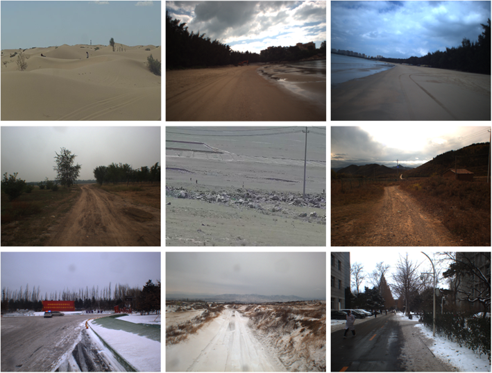
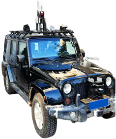
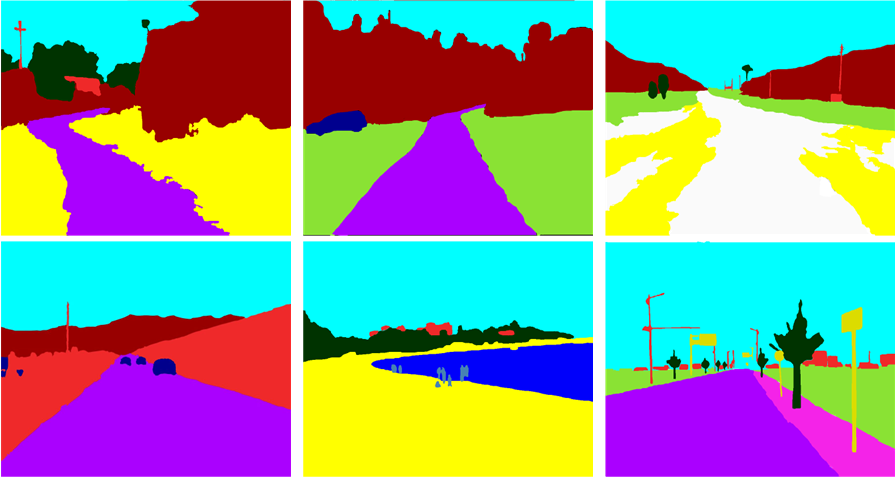
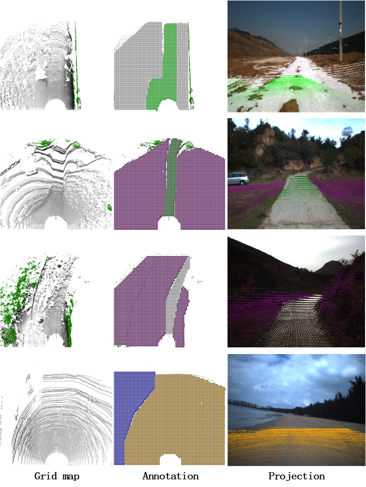

# Wild_Beyond: A Multi-Modal and Multi-Sence Dataset For Ground Semantic Understanding
## Overview

## Dataset Discription
Wild -Beyond indicates 33.3 per cent of paved sences and 66.7 per cent off-road scenes. The dataset is divided into 26 different categories with the aim of analysing the impact of time of day, weather conditions, and terrain environments on performance, including scenarios such as night-time city, daytime desert, and evening beach.The primary terrain encompasses seven categories: desert, beach, gravel, paved, water, snow, and grass. In addition, the dataset encompasses fifteen types of targets including car, people, traffic sign, ship, etc.The size format of the recorded image files is 1024 x 768 pixels. Also Wild -Beyond contains synchronised vehicle underlay and point cloud data, at night we also use infrared camera for data acquisition work, these multimodal data will help to advance the development of driverless technology.

## Recording Platform

[Jeep Wrangle](https://www.jeep.com/wrangler.html "The official website of Jeep Wrangle")

## Sensor Setup
-Three RS-M1 solid-state LiDARs are utilised to collect point cloud information within a 360° field of view around the vehicle, thereby enhancing the density of the point cloud. The scanning frequency is set at 10 Hz, while the horizontal field of view spans 120°, and the horizontal angular resolution is set at 0.2°. The vertical field of view is 25°, and the vertical angular resolution is also set at 0.2°. The maximum detection distance is 200 m.

-A Velodyne HDL-32E LiDAR was utilised to acquire point cloud data over a 360° range of the vehicle. The number of radar lines is 32, the scanning frequency is 10 Hz, the horizontal field of view is 360°, the horizontal angular resolution is 0.08° to 0.33°, the vertical field of view is -30.67° to +10.67°, the vertical angular resolution is 1.33°, and the maximal detection distance is 100 m.

-A Ladybug LD5P-U3-51S5C-R/B panoramic camera for capturing image information over a 360° range of the vehicle. The camera can take very detailed photos with a resolution of 2448×2048, and it can take 30 photos per second. Each photo is 30 megapixels, and each pixel is 3.45μm×3.45μm.

-The MER2-231-41GC-P industrial camera has been utilised to facilitate the direct acquisition of image information in the frontal perspective of the wheeled platform. The camera possesses a resolution of 1024 x 768, with a maximum frame rate of 41fps at full resolution and a pixel size of 5.86μm x 5.86μm.

-An XW-GI7660 fibre-optic combined navigation system collects information about the vehicle's location, direction and speed from the satellite positioning system, and its position and movement information from the inertial navigation system. The heading accuracy is 0.05°(single-antenna dynamic alignment), 0.1°(low-dynamic dual-antenna assistance), 0.04°(post-processing,1σ); the attitude accuracy is 0.02° (real-time, 1σ), 0 .0 (post-processing 1σ); the positional accuracy is single-point positioning ≤1.2m (RMS), RTK2cm+1ppm (RMS), and the velocity accuracy is 0.02m/s (carrier speed is less than 500m/s).

The setup and detection range of each sensor. 

## Annotations
### Image
The semantic annotation of images is achieved by SAM.

### Point cloud
The construction of the corresponding grid map was achieved by integrating the collected LiDAR point cloud data with GPS positioning and IMU combined navigation data. The ground semantics were annotated on the grid map.

## Data Sample
We offer some samples here for you to know Wild-Beyond better.

-[Sample 1]()

-[Sample 2]()

-[Sample 3]()

*More data will coming soon! For more information, you can email [wbythink@163.com](wbythink@163.com) with the title "Wild-Beyond Access Request".

