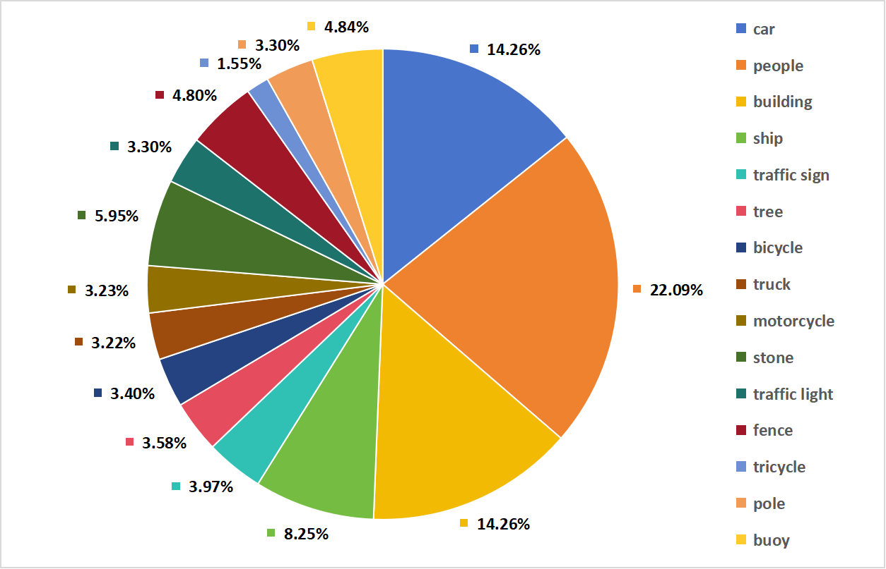
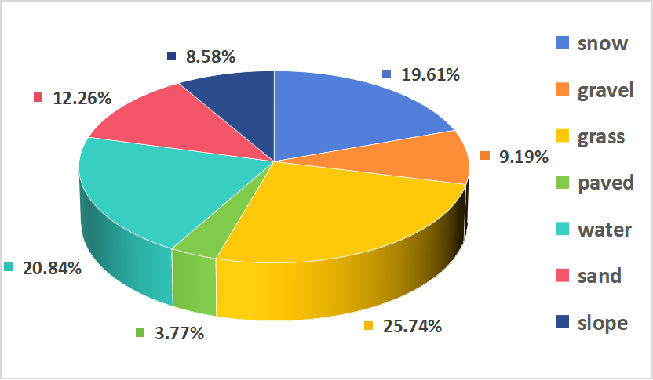
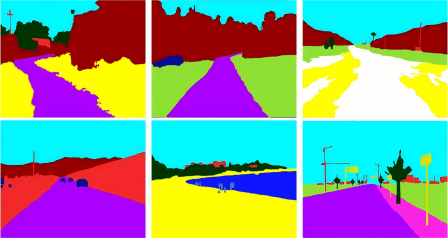

# TerraVerse: A Multimodal Sensor Dataset for Unstructured Scenes Spanning Multiple Regions in China

**This work was jointly completed by **Beijing Institute of Technology** and **Beijing University**.

## Overview

[](https://github.com/user-attachments/assets/cf26d446-ae29-4373-8b5e-173f74f38c35)


## Dataset Discription
  TerraVerse indicates 33.3 per cent of paved sences and 66.7 per cent off-road scenes. The dataset is divided into 26 different categories with the aim of analysing the impact of time of day, weather conditions, and terrain environments on performance, including scenarios such as night-time city, daytime desert, and evening beach.The primary terrain encompasses seven categories: desert, beach, gravel, paved, water, snow, and grass. In addition, the dataset encompasses fifteen types of targets including car, people, traffic sign, ship, etc. The size format of the recorded image files is 1024 x 768 pixels. Also TerraVerse contains synchronised vehicle underlay and point cloud data, at night we also use infrared camera for data acquisition work, these multimodal data will help to advance the development of driverless technology.

<div align=center>
  
</div>

## Recording Platform

Our data collection was performed using a [Jeep Wrangle](https://www.jeep.com/wrangler.html "The official website of Jeep Wrangle").


**The sensers used are introduced below:**

-Three [RS-M1](https://www.robosense.ai/rslidar/RS-LiDAR-M1) solid-state LiDARs are utilised to collect point cloud information. 

-A Velodyne [HDL-32E](https://pdf.directindustry.com/pdf/velodynelidar/hdl-32e-datasheet/182407-676098.html) LiDAR was utilised to acquire point cloud data over a 360° range of the vehicle. 

-A Ladybug [LD5P-U3-51S5C-R/B](https://www.teledynevisionsolutions.com/zh-cn/products/ladybug5plus/?model=LD5P-U3-51S5C-B&vertical=machine%20vision&segment=iis) panoramic camera for capturing image information over a 360° range of the vehicle. 

-The [MER2-231-41GC-P](https://www.daheng-imaging.com/show-104-1900-1.html) industrial camera has been utilised to facilitate the direct acquisition of image information in the frontal perspective of the wheeled platform. 

-An [XW-GI7660](https://www.starneto.com/chanpin_view/498.html) fibre-optic combined navigation system collects information about the vehicle's location, direction and speed from the satellite positioning system, and its position and movement information from the inertial navigation system. 

The left image is the recording platform and the right one shows the setup and detection range of each sensor:

<table>
  <tr>
    <td>
      
    </td>
    <td>
      
    </td>
  </tr>
</table>


## Annotations

We have annotated both targets and semantics, including 15 independent target classes and 7 terrain semantic categories. The proportions of each category are shown in the figure below.

<table>
  <tr>
    <td>
      
    </td>
    <td>
      
    </td>
  </tr>
</table>

### Target labelling
TerraVerse database 15 distinct categories of objects, including car, people, and ship, among others. Each category has been meticulously annotated to ensure precision and clarity. We used Open_Labeling to annotate the image targets, and the annotation results were in YOLO format.

<div>
  
</div>


### Semantic annotation
  The construction of the corresponding grid map was achieved by integrating the collected LiDAR point cloud data with GPS positioning and IMU combined navigation data. The ground semantics were annotated on the grid map.

.png)

All the semantics that appear in the scene have been explicitly labelled on the image. The semantic annotation of images is achieved by SAM, and the annotation results are displayed below.



## Data Sample
We offer some samples here for you to know TerraVerse better. The sample files we uploaded encompass raw images, LIDAR data, and some annotated examples. The image data is in "png" format, while the point cloud data from the laser radar is in "pcap" format. We have annotated both the objects and semantics. The structure of the sample files is illustrated in the figure below:


```
Sample
├─rawdata
│  ├─image
│  │      1602313407553149.png
│  │      1602313407619700.png
│  │      ...
│  │
│  └─lidar
│          Raw-001-HDL32.pcap
│
├─semantic annotation
│  ├─grid_map_annotation
│  │  ├─gridmap
│  │  │  ├─annotation
│  │  │  │      54208152.png
│  │  │  │      54208819.png
│  │  │  │      ...
│  │  │  │
│  │  │  └─background
│  │  │          54208152_background.png
│  │  │          54208819_background.png
│  │  │          ...
│  │  │
│  │  ├─projection
│  │  │  ├─ladybug camera
│  │  │  │      54208152_cam.png
│  │  │  │      54208152_cam_raw.png
│  │  │  │      54208819_cam.png
│  │  │  │      54208819_cam_raw.png
│  │  │  │     ...
│  │  │  │
│  │  │  └─mono camera
│  │  │          54208152_pro.png
│  │  │          54208819_pro.png
│  │  │          ...
│  │  │
│  │  └─result_csv
│  │          54208152.csv
│  │          54208819.csv
│  │          ...
│  │          label_map.csv
│  │
│  └─image_annotation
│      │  classesition.txt
│      │
│      ├─json
│      │      1602313408152146.json
│      │      1602313408819041.json
│      │      ...
│      │
│      └─png
│              1602313408152146.png
│              1602313408819041.png
│              ...
│
└─target labeling
    ├─labeled-image
    │      1602313408152146.png
    │      1602313408819041.png
    │      ...
    │
    └─result_txt
            1602313408152146.txt
            1602313408819041.txt
            ...
            class_list.txt
  ```

***Samples can be downloaded here:**

**Google Drive:** 
<pre>

    -[Sample 1]()

    -[Sample 2]()
  
</pre>

**Baidu Pan:**

-[Sample 1]()

-[Sample 2]()

*More data will coming soon! For more information, you can email [boyang_wang@bit.edu.cn](boyang_wang@bit.edu.cn) with the title "TerraVerse Access Request".


